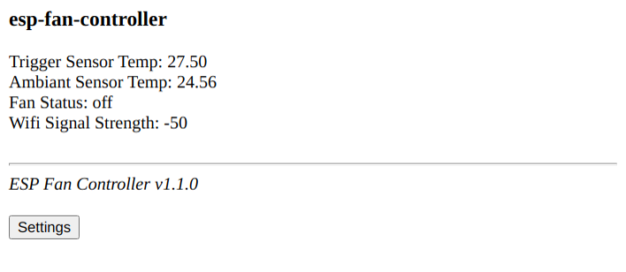
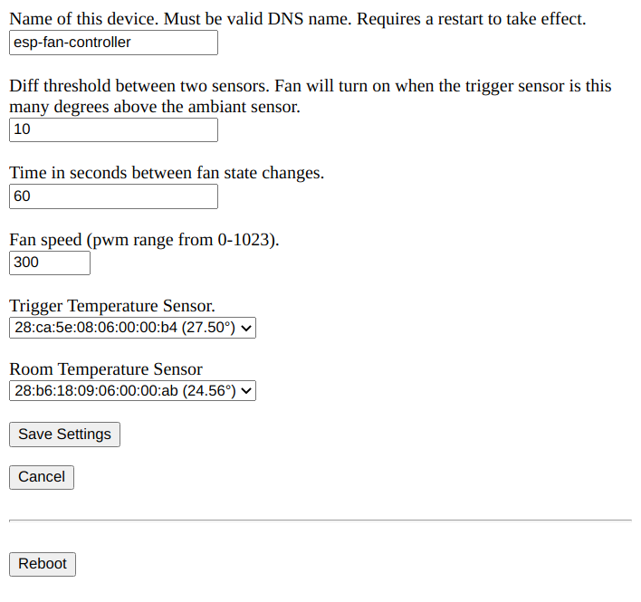
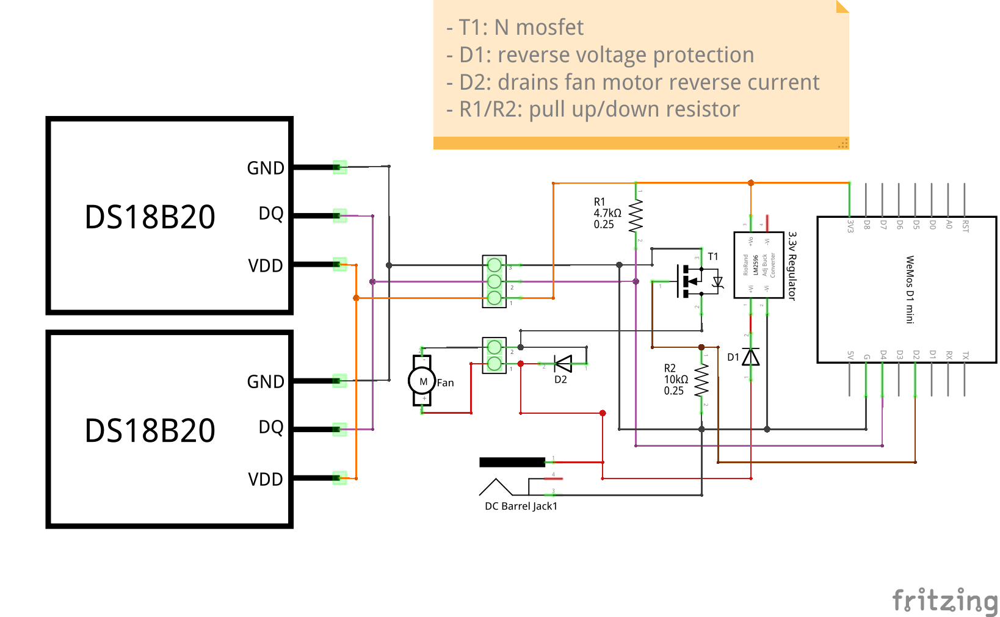

# ESP Fan Controller

ESP8266 based fan controller with a webui. 

This is designed for applications where the fan should turn on when one temp probe (the trigger probe) is x degrees warmer than the other (the ambiant probe). 

Example usecases:
* Turn on a radiator fan when the radiator is warmer than the room.
* Turn on an cooling fan when the outside temp is cooler than inside the house.

This project uses two ds1820 sensor. It also provides a basic web interface. 

The webui index provides the current sensor values and is updated every few seconds. The /status endpoint also provides this and more information in json.
The webui also allows you to configure all of the device settings.

## Instructions

After flashing, the device will create a wifi AP called `esp-fan-controller` with the password `fancontroller`. Connect to the ap, go to http://192.168.4.1, and configure your wifi details.

Once the device is connected to your network, connect to it using a web browser on port 80 and configure the temperature sensor addresses and other settings. 

Some debug information such as the device ip is printed to the serial port. You can also find it using mDNS.

As long as you do not erase the flash while updating, all setting will persist across updates. The device also supports OTA updates via the ArduinoOTA library (you must be on the same subnet as the device or flashing may fail).

## WebUI
Main index page

Settings page

## Electronic Design

